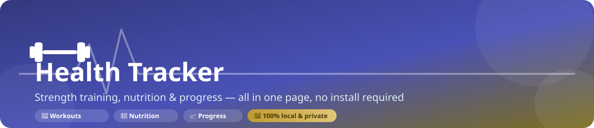
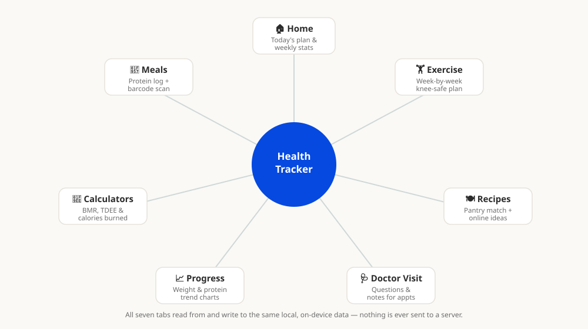
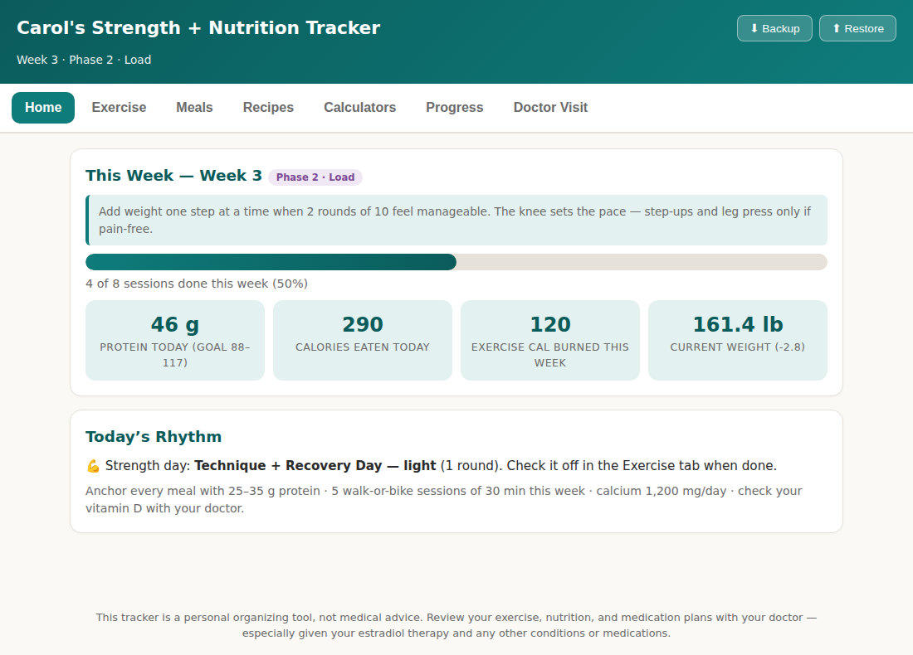
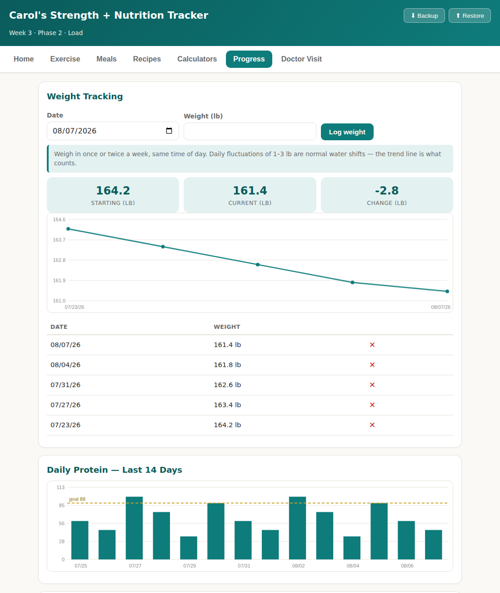
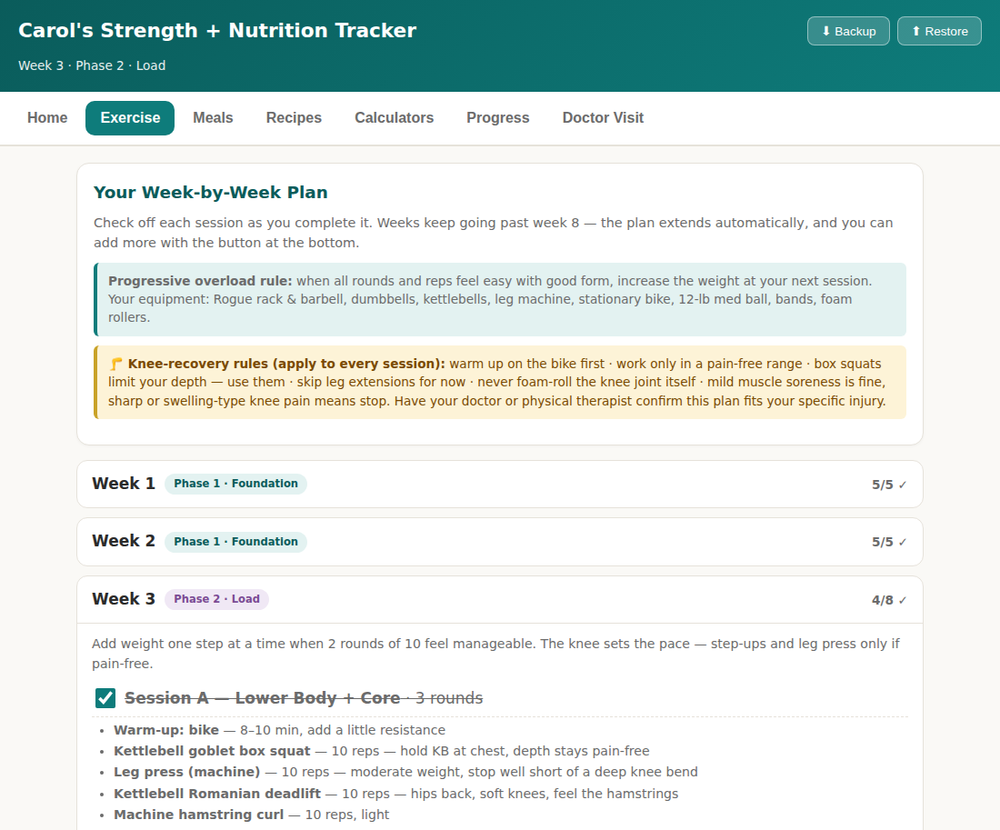

<p align="center">
  
</p>

<p align="center">
  
  
  
  
</p>

# Health Tracker

A single-file, no-install web app for tracking daily health habits — water, sleep, steps, strength workouts, protein/calories, body weight, and questions for your next doctor's visit. Open an HTML file in a browser and start logging; everything is saved on your own device.

This repo contains two versions:

| File | What it is |
|---|---|
| [`strength-nutrition-tracker.html`](strength-nutrition-tracker.html) | **The full app.** A complete strength-training + nutrition tracker with a week-by-week workout plan, meal/protein logging with barcode scanning, recipe suggestions, calculators, progress charts, and a doctor-visit question log. |
| [`index.html`](index.html) | A minimal starter page — logs date, water, sleep, steps, and notes to a table. Good as a lightweight alternative or a base to build your own tracker from. |

> **Not medical advice.** This is a personal organizing tool. Review any exercise, nutrition, or medication plan with your doctor.

---

## Why this exists

Most habit trackers either need an account, a subscription, or send your health data to someone else's server. This one doesn't. It's a static HTML page — open it, use it, and your data stays in your browser's `localStorage` on your own device. No sign-up, no backend, no tracking.

---

## How it fits together

<p align="center">
  
</p>

## Screenshots

**Home** — today's plan, weekly completion, and stat tiles:

<p align="center">
  
</p>

**Progress** — weight trend and daily protein charts:

<p align="center">
  
</p>

**Exercise** — the week-by-week strength plan:

<p align="center">
  
</p>

---

## Features (`strength-nutrition-tracker.html`)

- **🏠 Home** — today's workout or cardio prompt, weekly completion bar, and stat tiles for protein, calories, exercise burned, and current weight.
- **🏋️ Exercise** — an auto-progressing, week-by-week strength + cardio plan (Phase 1 → Maintenance) with checkboxes per session. Includes knee-recovery guidance baked into every session, and you can add extra weeks anytime.
- **🥗 Meals** — log meals with protein/calorie totals against a personalized daily target, one-tap "quick add" foods, and a **camera barcode scanner** that looks up packaged foods via the free [Open Food Facts](https://world.openfoodfacts.org/) database.
- **🍽️ Recipes** — add what's in your kitchen and get protein-forward recipe suggestions re-sorted by ingredient match, plus live recipe search via [TheMealDB](https://www.themealdb.com/).
- **🧮 Calculators** — BMR/TDEE (Mifflin-St Jeor) with calorie targets for steady weight loss, and a calories-burned calculator using MET values you can log straight to your activity history.
- **📈 Progress** — trend charts for body weight, daily protein (last 14 days), calories in vs. exercise calories out, and workouts completed per week — all drawn with plain `<canvas>`, no chart library.
- **🩺 Doctor Visit** — a running list of questions to bring to appointments, with space to type in the doctor's answers; add your own questions too.
- **⬇️ Backup / ⬆️ Restore** — export all your data to a JSON file and re-import it anytime (handy before clearing browser data or switching devices).

---

## Usage

No installation, build step, or server needed.

1. **Download or clone** this repository:
   ```bash
   git clone https://github.com/carolsand/health-tracker.git
   ```
2. **Open the app** by double-clicking the HTML file, or opening it from your browser:
   - Full app: `strength-nutrition-tracker.html`
   - Starter page: `index.html`
3. **First run:** the full tracker will ask for your start date, weight, height, and age to calculate your personalized plan and targets — takes about 30 seconds.
4. **Use it daily:** check off workouts, log meals (or scan a barcode), and log your weight once or twice a week.
5. **Back up your data** occasionally with the **⬇ Backup** button in the header — it downloads a `.json` file you can restore later with **⬆ Restore**.

Two features need an internet connection: the barcode/food lookup and the online recipe search. Everything else works fully offline.

### Serving it locally (optional)

Opening the file directly (`file://…`) works fine for normal use. If you'd rather serve it over `http://` (e.g. for camera permissions to behave more consistently across browsers):

```bash
npx serve .
# or
python3 -m http.server 8000
```

---

## Data & privacy

- All data is stored in your browser's `localStorage` under a single key — nothing is sent to a server except the two optional lookups above (barcode → Open Food Facts, recipe search → TheMealDB), which send only the data needed for that query.
- Clearing your browser's site data will erase your log — export a backup first.
- Data doesn't sync between browsers or devices automatically; use **Backup**/**Restore** to move it.

---

## Tech stack

Plain HTML, CSS, and JavaScript — no framework, no bundler, no dependencies to install. The only external calls are the two optional API lookups described above; charts are hand-drawn with the Canvas API.

---

## License

[MIT](LICENSE) © Carol Sanders
